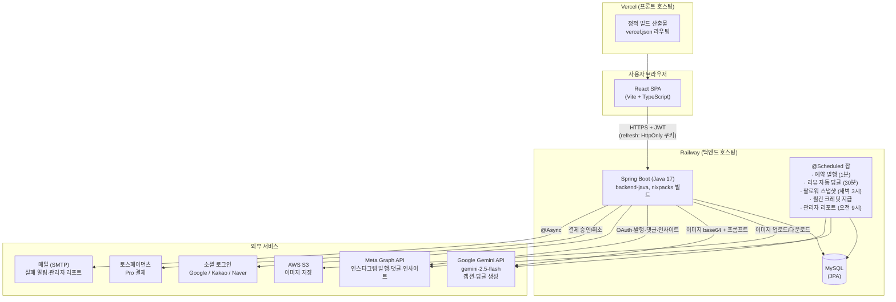

# 12. 시스템 아키텍처

작성일: 2026-07-09 | 기준: 배포 완료 상태 (Vercel + Railway), Phase 5-1 포함

---

## 1. 전체 구조도



---

## 2. 컴포넌트별 설명

### 2-1. 프론트엔드 — React SPA (Vercel)
- Vite + TypeScript, 상태는 React Context(AuthContext) + 페이지 로컬 상태
- `api/client.ts`: axios 인스턴스 — JWT 자동 첨부, 401 시 refresh 쿠키로 토큰 재발급(single-flight) 후 1회 재시도
- i18n(ko/en), 다크 모드, 페이지 라우팅은 `App.tsx` (관리자 `/admin` 포함)
- 배포: git push → Vercel이 `frontend/`를 빌드해 CDN 배포

### 2-2. 백엔드 — Spring Boot (Railway)
패키지 구조 (도메인형):

| 패키지 | 역할 |
|---|---|
| `auth` | 회원가입/로그인, JWT 발급, 소셜 OAuth 클라이언트, refresh token 회전 |
| `security` | JWT 필터 → `UserPrincipal`(id, email, admin) 주입. 관리자 = `ADMIN_EMAIL` 일치 |
| `user` | 프로필, 크레딧(온보딩/광고 충전), 회원 탈퇴 |
| `post` | 이미지 업로드(S3), Gemini 캡션 생성, 게시물 CRUD, 인사이트 조회 |
| `instagram` | Meta OAuth 연동, 계정 관리, 발행(컨테이너 생성→publish) |
| `schedule` | 예약 CRUD + 스케줄러 잡 5종 |
| `review` | 댓글 동기화, AI 답글 초안, 승인/자동 발행 |
| `analytics` | 자체 DB 통계 + 팔로워 추이 |
| `payment` | 토스 결제 승인/취소, 플랜/사용량 |
| `admin` | 관리자 대시보드 집계 (Phase 5-1) |
| `email` | `@Async` 메일 발송 |

### 2-3. 데이터 (MySQL)
주요 테이블: `users`(플랜·크레딧), `instagram_accounts`(토큰·auto_reply_enabled), `posts`(draft/scheduled/posted/failed), `scheduled_posts`(pending/done/failed, retry_count), `payments`(PAID/CANCELED, valid_until), `refresh_tokens`, `follower_snapshots`, `review_comments`. 상세는 `docs/04_DB설계서.md`.

---

## 3. 핵심 요청 흐름

### 3-1. 캡션 생성 → 발행
```
사용자: 사진 선택 → (편집) → 캡션 생성 요청
  1. POST /api/posts/upload — 이미지를 S3에 저장, URL 반환
  2. POST /api/posts/caption — 크레딧 원자적 차감(UPDATE ... WHERE credits > 0)
     → 서버가 S3에서 이미지 다운로드 → base64 → Gemini에 이미지+업종/분위기 프롬프트 전달
     → 캡션·해시태그 응답
  3-a. 즉시 발행: POST /api/posts/:id/publish — Meta 미디어 컨테이너 생성 → publish
  3-b. 예약: POST /api/scheduled — pending으로 저장
```

### 3-2. 예약 발행 (스케줄러)
```
ScheduledPublishJob (1분마다):
  pending && scheduled_at <= now && retry_count < max 조회
  → Meta 발행 시도 → 성공: post=posted, schedule=done
  → 실패: retry_count++, 최종 실패 시 failed + @Async 이메일 알림
```

### 3-3. 인증
```
로그인(이메일 or 소셜) → access token(JWT, 헤더) + refresh token(HttpOnly 쿠키, 회전식)
API 401 → 프론트가 /api/auth/refresh 호출(single-flight) → 새 토큰으로 재시도
관리자: JWT email == ADMIN_EMAIL → ROLE_ADMIN → /api/admin/** 접근
```

---

## 4. 동시성 처리

| 지점 | 방식 |
|---|---|
| API 요청 | Tomcat 스레드 풀(기본 200) — 사용자별 요청 병렬 처리 |
| 크레딧 차감 | DB 원자적 UPDATE (`credits > 0` 조건 포함) — 동시 요청에도 음수 불가 |
| 크레딧 지급 | `SELECT ... FOR UPDATE` (비관적 잠금) — 온보딩 보너스 중복 지급 방지 |
| 이메일 발송 | `@Async` — 요청/스케줄러 스레드 비블로킹 |
| 스케줄러 | ⚠️ 기본 단일 스레드에 잡 5종 공유 — 풀 확장 백로그 (`docs/TODO/개선백로그.md`) |

---

## 5. 보안 요약
- CORS: 프론트 오리진만 허용 (와일드카드+credentials 금지)
- 비밀번호 bcrypt(10), `.env` 비커밋, 시크릿은 호스팅 환경변수
- OAuth state nonce (CSRF 방지), refresh token 회전(탈취 시 1회성)
- 상세 점검 내역: `docs/08_보안품질점검보고서.md`

---

## 변경 이력
| 버전 | 날짜 | 내용 |
|---|---|---|
| v1.0 | 2026-07-09 | 최초 작성 |
